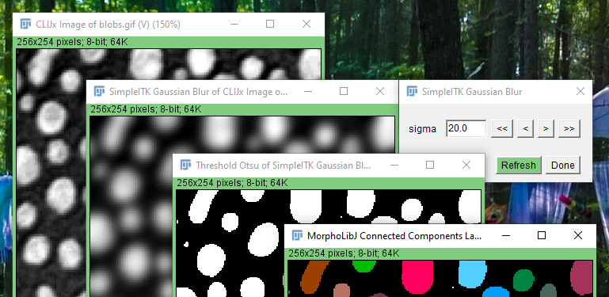

## CLIJx-SimpleITK bridge
This repository bridges [SimpleITK](https://simpleitk.org/) and [clij](https://clij.github.io).



This is preliminary right now.

## Installation in Fiji
Follow the installation instructions [here](https://clij.github.io/assistant/installation#extensions). 
At the moment, only Windows and MacOS are supported.

## How to build
Download the Simple-ITK-Java package of your operating system from [here](https://github.com/SimpleITK/SimpleITK/releases),
unpack it and enter the right path to the jar files in the pom.xml file of this project. It should then build using

```
mvn package
```

In order to deploy the development version to Fiji, change the path where your local Fiji is installed in the pom file:
```
<imagej.app.directory>C:/programs/fiji-win64/Fiji.app/</imagej.app.directory>
```

and run 

```
mvn install
```

Last but not least, you may have to copy `SimpleITKJava.dll` from the downloaded SimpleITK package to the `lib/win64` folder of Fiji:
```
Fiji.app/lib/win64/SimpleITKJava.dll
```

To check if the installation worked, run Fiji, open an image and run `Plugins>ImageJ on GPU (CLIJx)>Filter>SimpleITK Gaussian Blur`.
